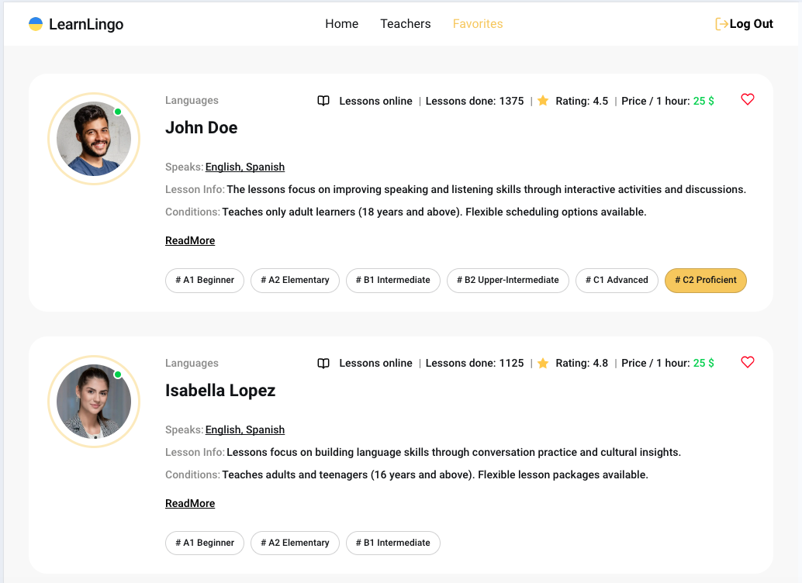

# Learn Lingo

## 🌟 Project Overview

**Learn Lingo** is a cutting-edge web application designed to connect users with language tutors from around the globe. Whether you're embarking on your first language journey or perfecting your fluency, this platform offers a seamless way to find the perfect tutor tailored to your goals.

### Key Features

- **🌍 Comprehensive Tutor Search**: Effortlessly filter tutors by **Languages**, **Skill Level**, and **Price** to find your ideal match.
- **❤️ Favorites Management**: Save and revisit your favorite tutors with ease (login required).
- **📄 Detailed Tutor Profiles**: Dive into detailed tutor ratings, authentic reviews, and language proficiency levels.
- **📱 Responsive Design**: Enjoy a polished and consistent user experience across all devices, from desktops to mobile phones.

## 🛠 Tech Stack

**Learn Lingo** leverages modern web technologies to deliver an optimal user experience:

### Frontend:
- **⚛ React** (v18.3.1): Building intuitive and dynamic user interfaces.
- **🚦 React Router** (v6.28.0): Enabling smooth, client-side routing.
- **🛠 Redux Toolkit**: Managing application state efficiently.
- **🗃 Redux Persist**: Ensuring state persistence across sessions.

### Backend and Services:
- **🔥 Firebase**: Powering authentication and real-time database services.

### Styling:
- **🎨 SCSS**: Creating modular and reusable styles.
- **🖌 Modern Normalize**: Achieving consistent cross-browser rendering.

### Utilities:
- **🧩 clsx**: Simplifying conditional class management.
- **🔍 react-helmet-async**: Managing SEO-friendly meta tags.
- **⏳ react-loader-spinner**: Indicating loading states with stylish spinners.
- **✅ Yup**: Streamlining schema-based form validation.
- **📝 React Hook Form**: Simplifying form management and validation.

## 🚀 Quick Start

Follow these steps to set up and run the project locally:

1. **Clone the repository:**
   ```bash
   git clone https://github.com/gudzsv/learn-lingo.git
   ```

2. **Navigate to the project directory:**
   ```bash
   cd learn-lingo
   ```

3. **Install dependencies:**
   ```bash
   npm install
   ```

4. **Start the development server:**
   ```bash
   npm run dev
   ```

5. **Access the application:**
   Open your browser and navigate to `http://localhost:5173`.

## 📸 Screenshots

### Home Page


### Teachers


### Favorites Page


## 👨‍💻 Author

**Developed by:** Serhii Hudzenko

- **✉️ Email:** [gudzsvmail@gmail.com](mailto:gudzsvmail@gmail.com)
- **🐙 GitHub:** [Serhii Hudzenko](https://github.com/gudzsv)

Feel free to reach out with questions, suggestions, or collaboration opportunities!

